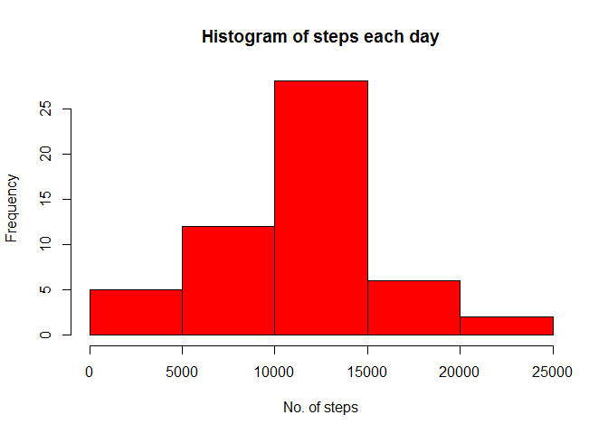
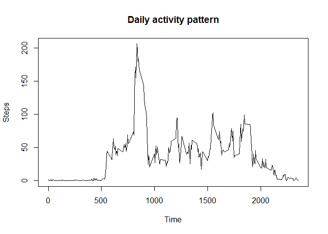
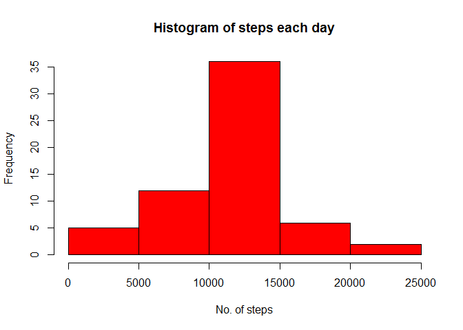
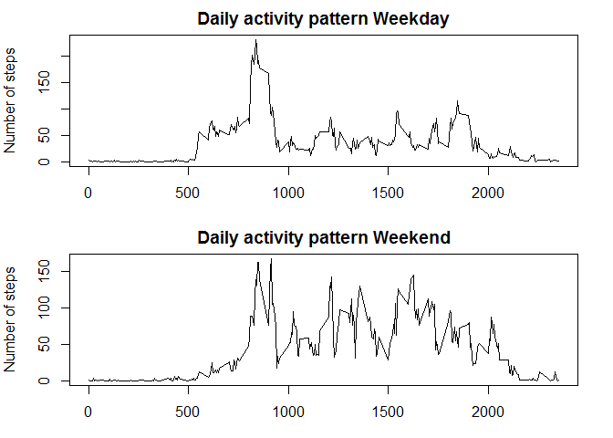

# Reproducible Research: Peer Assessment 1

## Metadata and dependencies
Author: ME
Data forked from: https://github.com/rdpeng/RepData_PeerAssessment1
Date: 23.03.2016

The analysis here needs the following packages installed:
library(ggplot2)
library(dplyr)
library(knitr)
library(Hmisc)
library(plyr)
library(lubridate)

## Loading and preprocessing the data
The loading and preprocessing of the data for later analysis.
Download and unzip the data to the working directory.

pa1 contains the raw data.
pa2 is data for the histogram (aggregated per date).
pa3 is the data for the first time series plot (aggregated per interval).
The last line generates the histogram.


```r
pa1 <- read.csv("activity.csv")
pa2<-aggregate(pa1$steps,by=list(pa1$date),FUN=sum)
pa3<-aggregate(pa1$steps, by=list(pa1$interval), FUN=mean, na.rm=TRUE)
hist(pa2$x, main="Histogram of steps each day", xlab="No. of steps", col = "red")
```



## What is mean total number of steps taken per day?
The mean and median is calculated per day.


```r
mean(pa2$x, na.rm=TRUE)
```

```
## [1] 10766.19
```

```r
median(pa2$x, na.rm=TRUE)
```

```
## [1] 10765
```


## What is the average daily activity pattern?
A timeseries plot showing the average activity over the day.
Subsequently the 5 min interval with the max activity is found.

```r
plot(pa3$Group.1,pa3$x, type="l", main="Daily activity pattern", xlab="Time", ylab="Steps")
```



```r
pa3$Group.1[pa3$x==max(pa3$x)]
```

```
## [1] 835
```


## Imputing missing values
The number of NAs is calculated.
The missing values are imputed by using the mean for that 5 min time interval.
After imputing missing values, a new histogram is made on date aggregated steps.

OBS unfortunately this ddply will not work for me in knitr.

pa1.i<-ddply(pa1, "interval", mutate, steps = impute(steps, mean)). I get an ddply error when I run the knit HTML.

A new mean and median is calculated (aggregated per date). 

```r
sum(is.na(pa1$steps))
```

```
## [1] 2304
```

```r
pa1.i<-pa1
pa1.i$steps[is.na(pa1.i$steps)] <- pa3$x[match(pa1.i$interval,pa3$Group.1)][is.na(pa1.i$steps)]

pa2.i<-aggregate(pa1.i$steps,by=list(pa1.i$date),FUN=sum)
hist(pa2.i$x, main="Histogram of steps each day", xlab="No. of steps", col = "red")
```



```r
mean(pa2.i$x)
```

```
## [1] 10766.19
```

```r
median(pa2.i$x)
```

```
## [1] 10766.19
```

The mean is the same, as before data was imputed (as the mean is used for the imputed data)
The median has shifted to be identical to the mean.

## Are there differences in activity patterns between weekdays and weekends?
Date is formatted to dates. 
A new column (day) is calculated (weekday or weekend).
The column (day) is formatted as factor

OBS I cannot make the qplot with facets work in the knitr HTML.

This is why the data is subsetted and plotted on two different plots


```r
pa1.i$date<-strptime(pa1.i$date,"%Y-%m-%d")
pa1.i2<-pa1.i
pa1.i2$day<-ifelse(weekdays(pa1.i2$date, abbreviate = TRUE) %in% c("ma","ti","on","to","fr"),"Weekday","Weekend")
pa1.i2$day<-as.factor(as.character(pa1.i2$day))

pa4<-aggregate(pa1.i2$steps, by=list(pa1.i2$interval,pa1.i2$day), FUN=mean)
pa5<-subset(pa4, pa4$Group.2=="Weekday")
pa6<-subset(pa4, pa4$Group.2=="Weekend")
par(mfrow=c(2,1),mar=c(3,4,2,2))
plot(pa5$Group.1,pa5$x, type="l", main="Daily activity pattern Weekday", xlab="Time", ylab="Number of steps")
plot(pa6$Group.1,pa6$x, type="l", main="Daily activity pattern Weekend", xlab="Time", ylab="Number of steps")
```



As most people our test person gets up later in the weekend.
